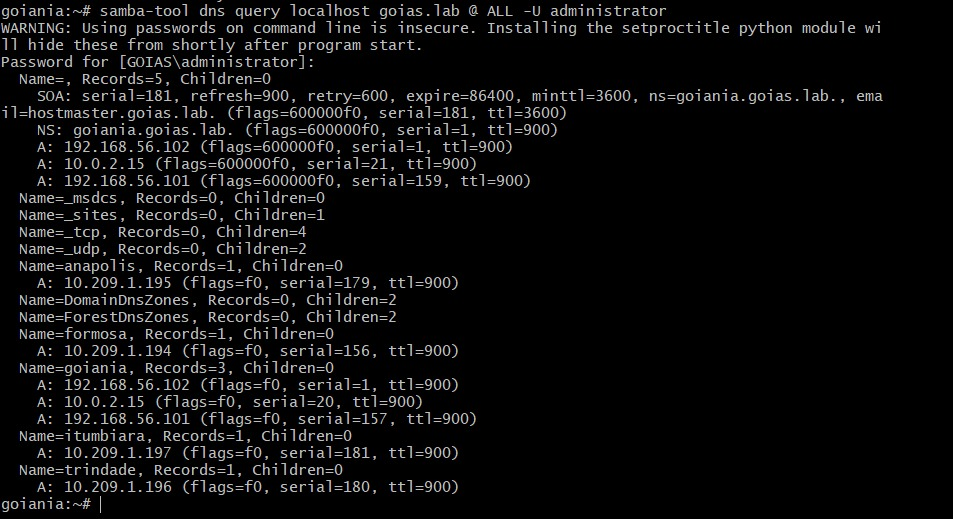

# Registros de Recurso do DNS

Pontuação: 30 pontos
 
Usando comando `samba-tool`, crie 4 registros do DNS do tipo A (Vide Planilha passada no GSA)


Use o seguinte comando para listar todos os registros de sua zona:

- `samba-tool dns query 127.0.0.1 "<estado>.lab" @ ALL -U administrator`
--- 
# Comandos samba-tool dns para Gerenciamento de Registros DNS

### O utilitário samba-tool permite gerenciar várias funcionalidades do Samba, incluindo a configuração e manipulação de registros DNS em um ambiente de Active Directory. Abaixo estão os comandos utilizados para adicionar e consultar registros DNS no Samba.

## Adicionando Registros DNS A

### O registro DNS do tipo A mapeia um nome de host para um endereço IPv4. A sintaxe geral para adicionar um registro A é:

```bash
samba-tool dns add <servidor DNS> <domínio> <nome do host> A <endereço IPv4> -U <usuário>
```

## Criação de Registros:

### 1. Adicionar o registro 'formosa' com o IP 10.209.1.194
```bash
samba-tool dns add localhost goias.lab formosa A 10.209.1.194 -U administrator
```

### 2. Adicionar o registro 'anapolis' com o IP 10.209.1.195
```bash
samba-tool dns add localhost goias.lab anapolis A 10.209.1.195 -U administrator
```

### 3. Adicionar o registro 'trindade' com o IP 10.209.1.196
```bash
samba-tool dns add localhost goias.lab trindade A 10.209.1.196 -U administrator
```

### 4. Adicionar o registro 'itumbiara' com o IP 10.209.1.197
```bash
samba-tool dns add localhost goias.lab itumbiara A 10.209.1.197 -U administrator
```


## Explicação dos parâmetros:

### localhost: Refere-se ao servidor DNS onde os registros serão adicionados.

### goias.lab: O domínio no qual os registros DNS estão sendo criados.

### formosa, anapolis, trindade, itumbiara: Nomes de hosts que estão sendo mapeados para endereços IP.

### A: Especifica que o tipo de registro DNS é um registro A (IPv4).

### 10.209.1.xxx: O endereço IP correspondente ao nome do host.

### -U administrator: Indica que o comando está sendo executado pelo usuário 'administrator' (você será solicitado a inserir a senha).


## Consultando Registros DNS

### Você pode consultar todos os registros DNS associados a um domínio usando o comando dns query. A sintaxe geral é:
```bash
samba-tool dns query <servidor DNS> <domínio> <zona ou @> <tipo de registro> -U <usuário>
```

### Exemplo:
```bash
samba-tool dns query localhost goias.lab @ ALL -U administrator
```

## Explicação dos parâmetros:

- `localhost`: O servidor DNS onde a consulta será feita.

- `goias.lab`: O domínio para o qual os registros DNS serão consultados.

- `@`: Refere-se à zona DNS raiz para o domínio.

- `ALL`: Especifica que todos os tipos de registros DNS devem ser consultados.

- `-U administrator`: Indica que o comando está sendo executado pelo usuário 'administrator' (será solicitada a senha).  

---
#### Saída do Query após criação dos registros:



## Resumo

### Esses comandos são utilizados para gerenciar registros DNS em um ambiente Samba AD:

### Adicionar registros A mapeando nomes de hosts para IPs.

### Consultar registros DNS para listar todas as entradas em um domínio.

